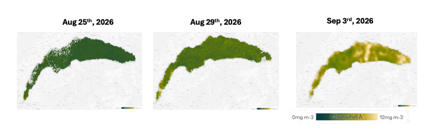
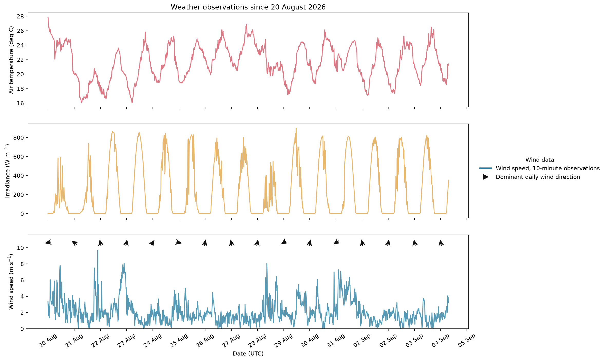
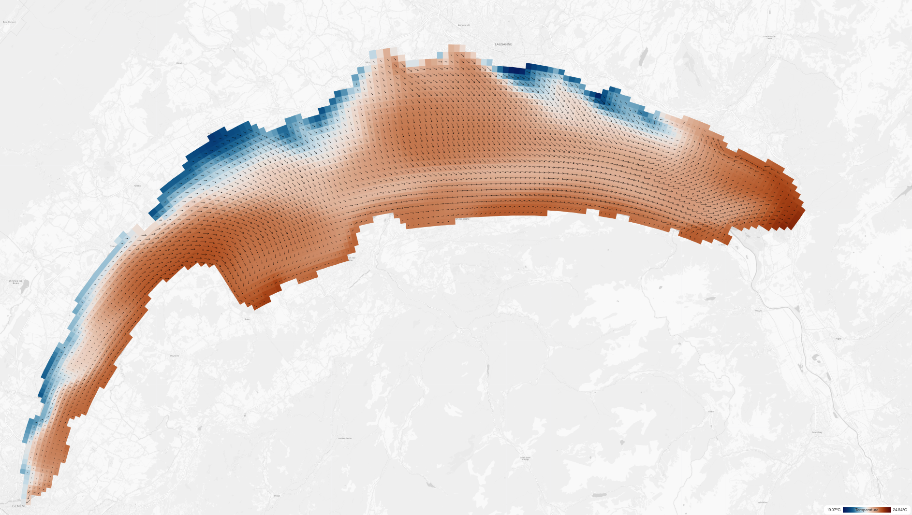
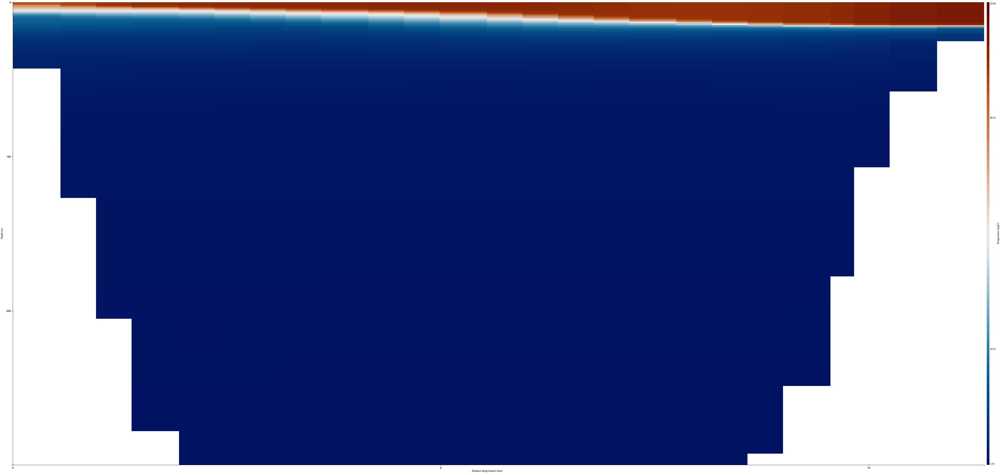
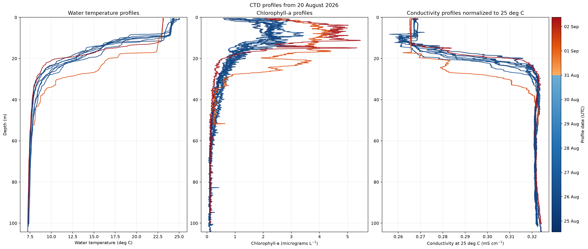
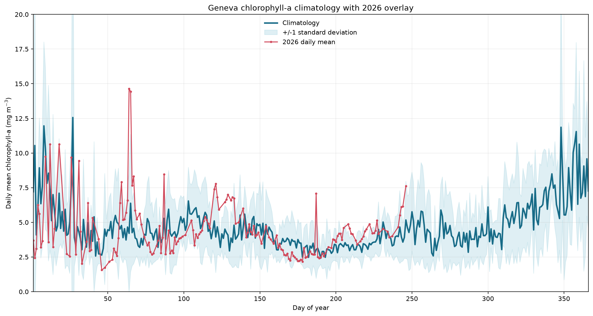
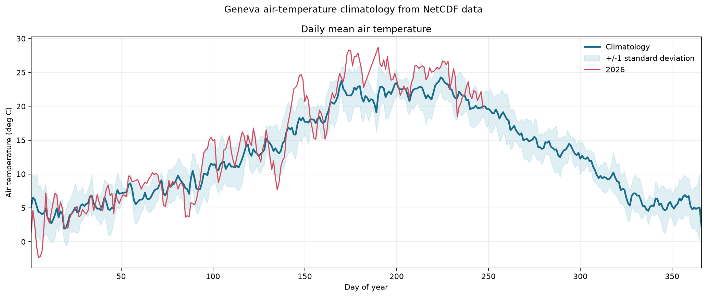
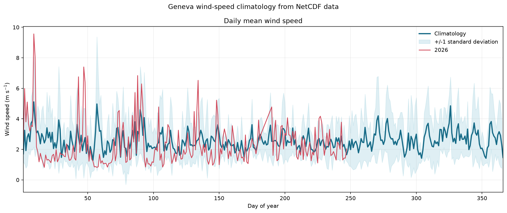
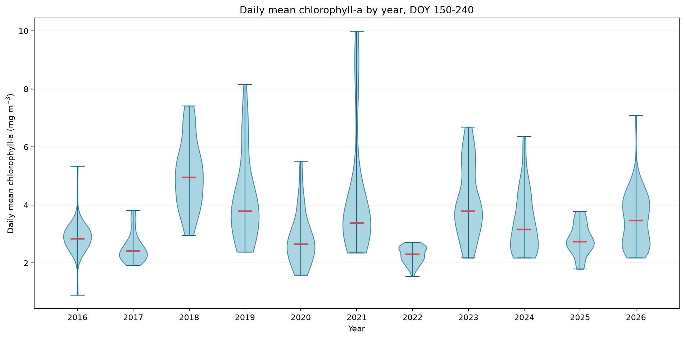

<section class="page">
  
Lake Geneva / Field note

  

  

    <h1>Why has Lake Geneva suddendly turned green? </h1>
    
You may have noticed that the lake's water turned turbid and green in a matter of days. Sattelite images confirmed that while low in August 25th, the amount of algae has doubled as of today.

    
 What happenend and is this unusual? 

  

  <figure class="satellite-feature">
    
    <figcaption>Satellite chlorophyll-a observations, August–September 2026 Source asset: AlpLakes</figcaption>
  </figure>
  <figure class="weather-figure" style="margin-top: 34px;">
    
    <figcaption>Weather since 20 August 2026. Air temperature, irradiance, and wind speed are shown at the native 10-minute resolution; arrows indicate dominant daily wind direction. Source: DataLakes</figcaption>
  </figure>
  
<strong>Commentary</strong>   Over the week end and throughout monday, the North-East wind blew consistently. The weather has been quiet and sunny from Tuesday

</section>

<section class="page">
  
Page 02 / Water column

  <h2>Heat, mixing, and the water column</h2>
  
The temperature 3D model and CTD profiles provide the vertical context behind the surface signal.

  <figure class="video-feature">
    <video class="media" controls preload="metadata">
      <source src="Illustrations/TEMP_AUG28_SEP3.mp4" type="video/mp4">
      Your browser does not support embedded video. Open TEMP_AUG28_SEP3.mp4 directly.
    </video>
    <figcaption>Surface water temperatures from 28 August to 3 September 2026. Source asset: AlpLakes</figcaption>
  </figure>
  

    <figure class="temperature-illustration">
      
      <figcaption>Screenshot from 31 August 2026 showing the upwelling from bottom, cold water on the northern shore of Lake geneva. Source asset: Alplakes</figcaption>
    </figure>
    <figure class="temperature-illustration">
      
      <figcaption>Screenshot of a North-South transect of Lake Geneva, showing the warm surface waters being pushed by the synoptic wind southward. Source: Alplakes </figcaption>
    </figure>
  

  
<strong>Commentary</strong>   As the wind blew contitnuously from the NE, it pushed warm surface waters to the South-Western shore of the lake, leading to a downwelling downwind and an upwelling upwind. The 31 August temperature snapshot shows the upwelling of coldwaters along the northern shore. 

</section>

<section class="page">
  
Page 03 / CTD profiles

  <h2>What the water column reveals</h2>
  
The CTD profiles show how temperature, chlorophyll-a, and conductivity vary with depth during the event.

  <figure style="margin-top: 30px;">
    
    <figcaption>CTD depth profiles after 20 August 2026: water temperature, chlorophyll-a, and conductivity normalized to 25 °C. Profiles are colored by date.</figcaption>
  </figure>
  
<strong>Commentary</strong>   The wind event led to tilting and deepening of the thermocline and brought up to the surface colder waters. Deep cold waters are rich in nutrients, such as phosphorous...  While the surface waters were limited in nutrients, a fresh supply in phosphorous and sunny conditions makes the surface waters ground for algal growth

</section>

<section class="page">
  
Page 04 / Context

  <h2>Is this unusual?</h2>
  
The bloom is sudden but the climatology of remote-sensed chlorophyll for the lake over the latst 11 years shows that this regain in algal growth is rather typical for late summer. The satellite record places the 2026 chlorophyll-a observations within the seasonal distribution and the year-to-year spread.

  

    <figure>
      
      <figcaption>Geneva chlorophyll-a day-of-year climatology with 2026 observations overlaid. The analysis uses the satellite mean chlorophyll-a field.</figcaption>
    </figure>
    <figure>
      
      <figcaption>Mean air-temperature climatology with 2026 overlaid (2019-2026 from LéXPLORE Source DataLakes).</figcaption>
    </figure>
    <figure>
      
      <figcaption>>Mean windspeed climatology with 2026 overlaid (2019-2026 from LéXPLORE Source DataLakes).</figcaption>
    </figure>
    <figure>
      
      <figcaption>Annual distributions of daily mean chlorophyll-a for DOY 150–240 (from satellites, source: AlpLakes).</figcaption>
    </figure>
  

  
<strong>Commentary</strong>   The wind regime for the year 2026 has been within typucally observd values since 2019. The summer of 2026 has been 4-5°C warmer than any summers obszrved from LéXPLORE since 2019. In spite of this canicular summer, the amount of algae in the lake has been very consistent with values observed in the previous year, not more, not less. Wind-driven upwellings and seiches are transient but important and recurrent mechanisms to restore some nutrients to the surface waters in Lake Geneva in summer. 

</section>

